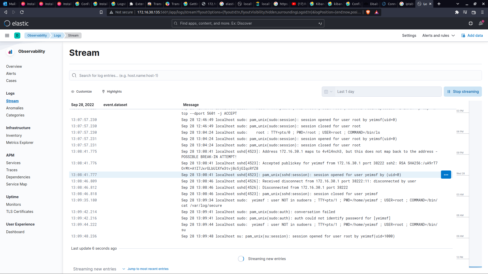

# Insecure Installation

## Elasticsearch

### Installation

```bash
wget https://artifacts.elastic.co/downloads/elasticsearch/elasticsearch-8.4.2-x86_64.rpm;
rpm -i elasticsearch-8.4.2-x86_64.rpm;
```

- Superuser password will be presented at stdout of elasticsearch installation
- username = elastic [default], password = <Generated_SuperUser_Password>
- After The installation is done:
  - Disabling SSL [Mandatory]:
    - Modify /etc/elasticsearch/elasticsearch.yml:
      - change anyhting under xpack from true to false to disable the security features
      - uncomment the network.host and http.host and make them = 0.0.0.0 in order to allow localhost and the ip given to the node both access elasticsearch
      - uncomment the transport.host and make it localhost
- Reload the daemon and enable/start elasticsearch
        `systemctl daemon-reload; systemctl enable elasticsearch.service; systemctl start elasticsearch.service`
- After Service Done
- open the browser and query `http://<Node_IP_Address>:9200` and provide the username and password from installation
- Should all the above steps execute successfully, the response should be like this:

    ```json
    {
    "name" : "4V4L4NCH3",
    "cluster_name" : "elasticsearch",
    "cluster_uuid" : "Hp-6X4YhR3q3F-2fN63jsA",
    "version" : {
    "number" : "8.4.2",
    "build_flavor" : "default",
    "build_type" : "deb",
    "build_hash" : "89f8c6d8429db93b816403ee75e5c270b43a940a",
    "build_date" : "2022-09-14T16:26:04.382547801Z",
    "build_snapshot" : false,
    "lucene_version" : "9.3.0",
    "minimum_wire_compatibility_version" : "7.17.0",
    "minimum_index_compatibility_version" : "7.0.0"
     },
    "tagline" : "You Know, for Search"
    }
    ```

## Kibana

### Installation

```bash
wget https://artifacts.elastic.co/downloads/kibana/kibana-8.4.2-x86_64.rpm;
rpm -i kibana-8.4.2-x86_64.rpm;
```

### Configuration

- server.host: Node IP Address
- elasticsearch.hosts: ["http://<Node_IP_Address>:9200"]

### Testing

- After That Open Kibana on `http://localhost:5601`

## Logstash

### Installation

```bash
wget https://artifacts.elastic.co/downloads/logstash/logstash-8.4.2-x86_64.rpm;
rpm -i logstash-8.4.2-x86_64.rpm
```

### Testing

1. Simple Test:
        `/usr/share/logstash/bin/logstash -e 'input { stdin {  }  } output { elasticsearch { hosts => ["127.0.0.1"] } }'`
   1. Enter any text in stdin
   2. Open Kibana -> Analytics -> Discover -> every input you entered should appear
2. Log File Stream Test:
        `/usr/share/logstash/bin/logstash -e 'input { file { path => "/var/log/secure" start_position => "beginning" } } output { elasticsearch { hosts => ["127.0.0.1"] } }'`
   1. Assuming /var/log/secure is a valid file path and contains data
   2. Events should also appear in Discover Section in Analytics App
   3. The Results were like the following:



## Firewall Bypass

- To Enable Remote Access To ELK Stack Permenantly:
  - Best To Use Firewall-cmd
  - `firewall-cmd --zone=public --add-port=9200/tcp --permanent`
  - `firewall-cmd --zone=public --add-port=5601/tcp --permanent`
  - `firewall-cmd --zone=public --add-port=5044/tcp --permanent`
